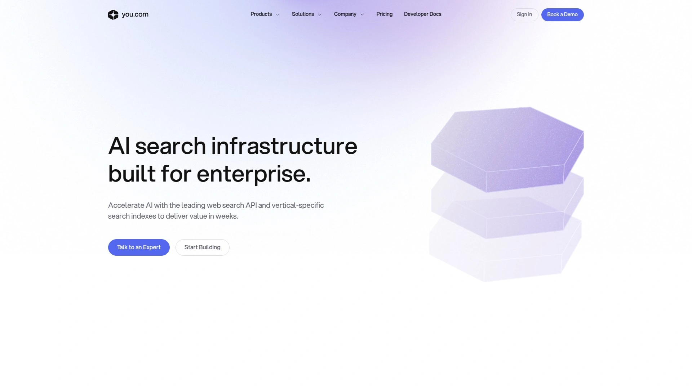
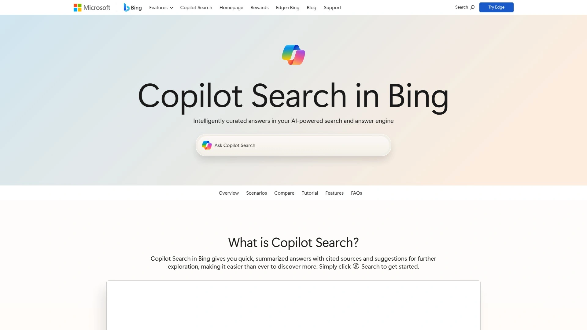
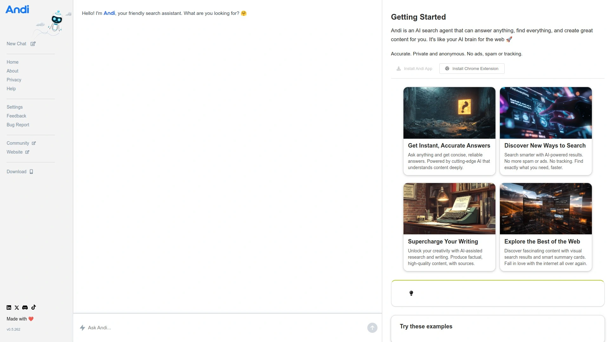
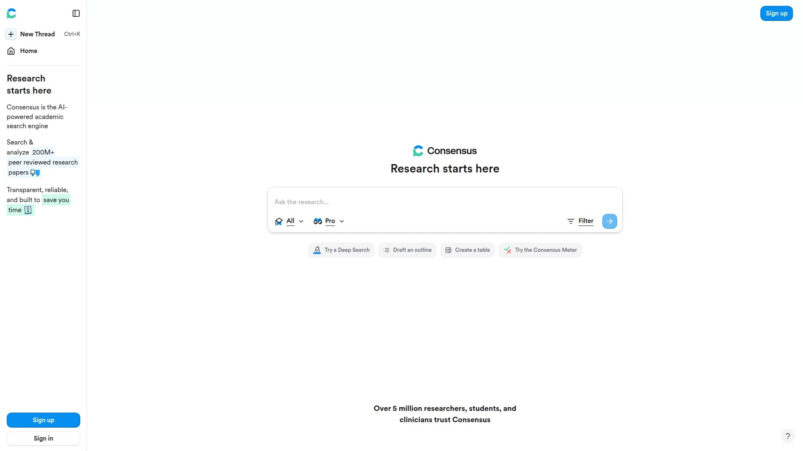
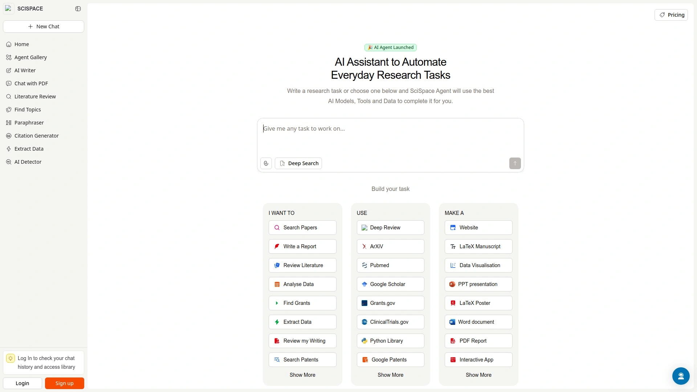
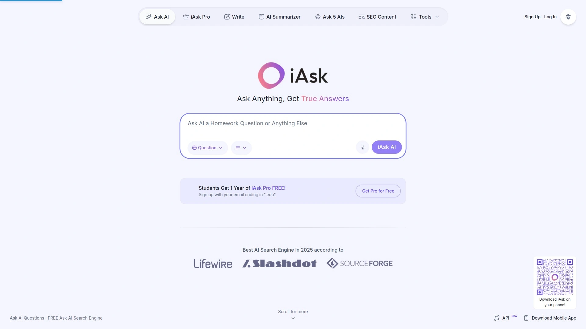

# Top 12 AI Search Engines Ranked in 2025 (Latest Compilation)

Finding what you need online shouldn't feel like detective work. Traditional search engines hand you a pile of links and say "good luck," but AI search engines actually understand what you're asking and give you direct answers with sources you can verify. They're changing how we research, learn, and make decisions by combining conversational interfaces with real-time web access.

These tools excel when you need quick summaries, research assistance, or answers to complex questions without clicking through dozens of tabs. Whether you're a student tackling a literature review, a developer debugging code, or someone who just wants straight answers without ads, these AI-powered search platforms deliver faster, cleaner results than scrolling through traditional search listings.

## **[Perplexity AI](https://pplx.ai/ixkwood69619635)**

Your conversational research companion that answers questions with citations.

Perplexity combines the conversational feel of a chatbot with the information-gathering power of a search engine. When you ask a question, it searches across multiple sources and synthesizes a clear answer with clickable citations, so you can verify every claim. The platform uses advanced models like GPT-4 Omni, Claude 3.5 Sonnet, and its proprietary Sonar models to deliver contextually relevant responses.

**What makes it work:** The Focus feature lets you narrow searches to specific sources like academic papers, Reddit discussions, or YouTube content. This targeted approach helps when you need domain-specific information rather than generic web results.

**For researchers:** Perplexity shines in scenarios requiring depth over breadth. Ask follow-up questions in the same thread, and it remembers your conversation context. The Pro version unlocks advanced models and allows file uploads for analysis.

**Interface design:** Clean, minimal, fast. No ads cluttering your view. Just your question, the answer, and sources lined up on the side. The mobile experience mirrors desktop functionality without compromise.

**Free tier:** Includes GPT-3.5 access with unlimited basic searches. Pro users get 300+ advanced searches daily with access to cutting-edge models, unlimited file uploads, and API access for $20 monthly.

## **[ChatGPT Search](https://openai.com/index/introducing-chatgpt-search/)**

OpenAI's conversational search that understands follow-up questions.

ChatGPT Search brings web access directly into the ChatGPT interface. Instead of switching between a chatbot and a browser, you get real-time information without leaving the conversation. The search function activates automatically when your question needs current data, or you can trigger it manually with a dedicated search button.

Built on a fine-tuned version of GPT-4o, it excels at understanding context and nuance. Ask about breaking news, weather, stock prices, or sports scores, and it pulls live data while maintaining the conversational flow. Source attribution appears inline, letting you jump to original articles when you want deeper details.

The system works with third-party providers including Microsoft Bing and content partnerships with major publishers like Reuters, The Atlantic, and Associated Press. This means answers pull from credible, verified sources rather than random web scraping.

No ads influence results. No SEO gaming affects rankings. Just AI-curated responses grounded in current web data with transparent sourcing.

## **[You.com](https://you.com)**

Multi-modal AI assistant that searches, writes, and generates images.

You.com started as a personalized search engine and evolved into a comprehensive AI workspace. The platform combines traditional web search with AI-powered chat capabilities, letting you pivot between browsing results and asking detailed questions about your findings.

**Model flexibility:** Switch between OpenAI's GPT-4, Anthropic's Claude series, and other leading models depending on your task. Free users get access to several models, while Premium subscribers unlock the full roster.

**Beyond search:** YouWrite handles content generation, YouCode assists with programming questions, and YouImagine creates images. This makes You.com less of a pure search tool and more of an integrated productivity platform.

**Customization focus:** The platform learns from your interactions to deliver increasingly relevant results. Upvote helpful sources, downvote poor ones, or block domains entirely to shape your search experience.

Pricing sits at $15 monthly for Premium, which includes priority access to advanced models and expanded usage limits.

## **[Brave Search with Leo AI](https://search.brave.com)**

Privacy-first search with built-in AI answers and no tracking.

Brave Search operates on its own independent index rather than piggybacking on Google or Bing. This independence, combined with their AI features, creates a search experience that prioritizes user privacy without sacrificing answer quality.

**AI Answers:** Ask questions and receive concise summaries with source references backing up key claims. The system uses open-source language models built in-house, giving Brave complete control over data handling.

**Ask Brave:** Need longer, more detailed responses? This mode provides extended answers with follow-up chat capabilities. Deep Research mode kicks in when thoroughness matters more than speed, analyzing multiple queries across diverse sources to build comprehensive reports.

**Privacy commitment:** Chat histories are encrypted and deleted after 24 hours of inactivity. No user profiles. No behavioral logging. No data lingering in corporate databases. This approach appeals to users wary of how AI companies handle sensitive queries.

Leo AI integrates directly into the Brave browser, requiring no sign-in or account creation. Just open it and start asking. Premium features cost $14.99 monthly.

## **[Google Gemini with AI Mode](https://gemini.google.com)**

Google's AI assistant with deep integration across their ecosystem.

Gemini represents Google's flagship AI offering, now deeply embedded in Search through AI Mode. When you ask complex questions, Gemini 2.5's advanced reasoning capabilities break down multi-step problems, organize information intelligently, and present answers with links for further exploration.

**Deep Search capability:** Available to Google AI Pro and Ultra subscribers, this feature browses hundreds of websites, reasons across disparate information, and crafts fully-cited reports in minutes. Perfect for major life decisions, financial analysis, or academic research requiring thorough synthesis.

**AI Overviews:** These appear directly in search results for quick answers without clicking through. Google's custom Gemini model combines multi-step reasoning, planning, and multimodal understanding with their core search infrastructure.

**Ecosystem advantages:** Seamless integration with Google Workspace means Gemini can access your Drive files, Gmail, Calendar, and other connected services for personalized assistance. This interconnectedness creates workflows impossible with standalone tools.

The free tier provides substantial functionality. Pro subscriptions start at $19.99 monthly, unlocking advanced models and Deep Search access.

## **[Microsoft Copilot Search](https://www.microsoft.com/en-us/bing/copilot-search)**

Enterprise-focused AI search integrated with Microsoft 365.

Copilot Search delivers AI-powered universal search optimized for organizational data. It goes beyond keyword matching by using AI to interpret context, relationships, and meaning across your entire Microsoft 365 environment and beyond.

**Unified access:** Search across emails, Teams chats, SharePoint documents, OneDrive files, and connected third-party systems from a single interface. Over 100 connectors in the Microsoft Catalog extend reach to non-Microsoft data sources.

**Semantic understanding:** The system comprehends intent rather than just matching words. Ask "show me the latest updates from John about budget planning" in natural language, and Copilot Search understands who, what, and when you're looking for.

**Search-to-chat transition:** Find what you need with search, then seamlessly shift to chat for deeper exploration or task completion. This design positions search as the organizing layer and chat as the execution workspace.

Enterprise-grade security includes SOC2 certification, data privacy controls, and user management. Pricing varies based on Microsoft 365 licensing tiers.

## **[Phind](https://www.phind.com)**

Developer-optimized AI search for coding questions and technical solutions.

Phind was built specifically for programmers and technical professionals who need fast, accurate answers to coding problems. Traditional search engines struggle with the jargon and context of developer queries, but Phind understands programming languages, frameworks, and technical documentation natively.

**Technical optimization:** Ask about API documentation, debugging strategies, or system design patterns, and receive answers with relevant code snippets. The platform analyzes multiple technical sources to provide comprehensive solutions beyond simple keyword matching.

**Model power:** Phind uses proprietary generative AI models trained on technical content, running on NVIDIA GPU-powered infrastructure. This specialized training delivers responses in 15 seconds instead of 15 minutes of manual searching.

**Use cases:** Designing communication between legacy Java systems and new Go microservices? Handling data discrepancies in real-time transmission? Phind synthesizes solutions from its technical knowledge base with explanations and implementation guidance.

The platform offers a free tier with basic functionality. Pro access costs $20 monthly, providing priority processing and advanced model access.

## **[Komo Search](https://komo.ai)**

Ad-free AI search with explore, chat, and mindmap features.

Komo combines traditional search with AI-powered exploration tools that help you discover trending discussions and brainstorm topics. The interface offers three distinct modes depending on how you want to engage with information.

**Search Mode:** Straightforward AI-enhanced results without advertising clutter. The ranking algorithm prioritizes relevance over commercial interests.

**Chat Mode:** Ask detailed questions for direct, conversational answers. The system maintains context across follow-up queries, making it effective for iterative research.

**Explore Mode:** This unique feature scans social media platforms and online communities for discussions about your topic, surfacing perspectives you might miss with conventional search.

**Deep Dive capability:** When thoroughness matters more than speed, Deep Dive mode conducts extensive research across sources and synthesizes findings into comprehensive overviews.

Multi-language support extends accessibility. Mobile apps for iOS and Android mirror web functionality. Free basic plan available, with Premium at $15 monthly for advanced AI model access.

## **[Andi Search](https://andisearch.com)**

Privacy-focused conversational search that blocks ads and tracking.

Andi delivers search results through a conversational interface that feels like chatting with a knowledgeable friend. Instead of link lists, you get direct answers with context and explanations, all without ads or tracking scripts monitoring your behavior.

**Generative AI integration:** Andi uses large language models with semantic search capabilities to understand query intent and context, not just keywords. This contextual awareness leads to more relevant results without the filter bubble effect.

**Privacy commitment:** No data collection. No behavioral tracking. No user profiles sold to advertisers. Andi's business model relies on providing a superior search experience rather than monetizing user attention.

**Summarization features:** The platform can condense lengthy articles, extract key points, and explain complex topics in accessible language. This makes it valuable for students and researchers who need to process large volumes of information quickly.

The interface maintains clean simplicity. Free to use with no premium tier currently offered, making advanced AI search accessible to everyone.

## **[Consensus](https://consensus.app)**

Academic-focused AI search for peer-reviewed research papers.

Consensus specializes in scientific literature, searching over 200 million academic papers from high-impact journals and the entirety of PubMed. Unlike general search engines, it exclusively processes scholarly content, ensuring answers come from credible research rather than random web pages.

**Research integrity:** The system searches literature first, then applies AI for summarization. This approach ensures every citation points to real papers, eliminating hallucinated sources that plague some AI tools.

**Safeguards:** Separate AI models verify source relevance before including papers in responses. If content doesn't meet relevance thresholds, it gets excluded. Every claim includes clickable citations to original sources.

**Use cases:** Ideal for literature reviews, exploring research questions, and synthesizing findings across multiple studies. Less effective for general knowledge questions or current events unrelated to academic research.

**Semantic search:** Increased accuracy by 30% compared to previous versions. Search latency reduced by 75%, making deep academic searches nearly instantaneous.

Free tier provides basic access. Premium features unlock advanced synthesis capabilities and extended search limits.

## **[Elicit](https://elicit.com)**

AI research assistant for automating literature review workflows.

Elicit targets academics and researchers conducting systematic literature reviews. The platform uses AI to find relevant papers, extract key data, and summarize findings, automating the tedious aspects of research synthesis.

**Literature review automation:** Enter a research question, and Elicit generates search results with relevant papers. The system provides titles, abstracts, summaries, and extracted metadata like publication dates, study types, and participant counts.

**Custom data extraction:** Add columns to pull specific information from papers. Want to know which studies involved human trials? Create a column with that criterion, and Elicit extracts the data across your entire result set.

**High accuracy mode:** Uses additional processing power to improve extraction precision. Particularly useful for meta-analyses and systematic reviews requiring rigorous data accuracy.

**Export functionality:** Download findings as CSV files for integration with statistical software or reference managers. This bridges the gap between discovery and analysis.

Free tier offers limited credits. Pro subscriptions provide expanded usage and advanced features for power users conducting extensive research projects.

## **[SciSpace](https://scispace.com)**

Multi-functional AI assistant for understanding and writing research papers.

SciSpace combines literature search with comprehension tools that help you understand complex scientific content. Highlight unfamiliar jargon, mathematical equations, or dense paragraphs, and SciSpace provides simple explanations with research-backed context.

**Copilot feature:** Available as a Chrome extension, Copilot lets you interact with papers while reading. Ask questions about methodology, request summaries of results sections, or clarify confusing passages without leaving the article.

**Literature review tool:** Search across 270+ million papers, extract key data from PDFs, and conduct efficient literature reviews with AI assistance. The system finds related papers based on highlighted passages, helping you discover relevant sources.

**Multi-language support:** Interact in 13 languages and receive explanations in your native language. This accessibility helps non-English speakers engage with scientific literature typically published in English.

**Citation generator:** Automatically generate citations in required formats. AI detector helps identify AI-generated content in academic writing.

Free tier provides basic functionality. Premium subscriptions unlock unlimited searches, advanced analysis, and extended AI features.

## **[iAsk AI](https://iask.ai)**

Free AI search engine achieving 93.89% accuracy on language benchmarks.

iAsk AI uses advanced natural language processing and Transformer language models to understand query context and intent, delivering precise answers across 57 diverse subject areas from humanities to hard sciences.

**Benchmark performance:** Scored 93.89% accuracy on the MMLU (Massive Multitask Language Understanding) benchmark, surpassing ChatGPT 4o by over 10% and exceeding average human expert accuracy of 89.8%.

**Natural language queries:** Ask questions conversationally rather than formulating keyword searches. The system interprets meaning and relationships between concepts, not just matching words.

**Usage scale:** Despite launching less than two years ago, iAsk AI processes 1.5 million daily searches, demonstrating user trust in its accuracy and reliability.

**Instant responses:** No sifting through links. Ask your question and receive factual answers immediately, with references for verification when needed.

Completely free to use with no sign-up required. Optional accounts enable personalized experiences and search history. Pro features available at $9.95 monthly for power users.

## How quickly can these AI search tools find specific information compared to traditional search?

Most AI search engines deliver synthesized answers in seconds rather than making you click through multiple links. Perplexity and ChatGPT Search typically respond in under 10 seconds for straightforward questions. Deep research modes in tools like Brave or Google Gemini take longer—a few minutes—but still save hours compared to manual research. Traditional searching might take 15-30 minutes of clicking, scanning, and piecing information together for complex questions.

## Which AI search engine works best for academic research and citations?

Consensus leads for pure academic research, searching 200+ million peer-reviewed papers with verified citations. Elicit and SciSpace follow closely, offering specialized literature review tools. Perplexity's Focus mode for academic sources provides solid middle ground when you need scholarly content mixed with other web sources. If you're writing papers and need rigorous citation management, stick with Consensus or Elicit.

## Do these AI search engines protect my privacy better than Google?

Privacy levels vary significantly. Brave Search and Andi lead with no tracking, no profiles, and encrypted chat histories deleted within 24 hours. Perplexity and You.com collect minimal data but aren't zero-tracking. Google Gemini and Microsoft Copilot integrate deeply with their ecosystems, meaning more data sharing. If privacy is paramount, Brave or Andi are your best choices. For enterprise security with some data collection, Microsoft Copilot offers SOC2 certification.

## Conclusion

Finding reliable information shouldn't waste your afternoon. These AI search engines transform how we research by delivering direct answers with verifiable sources, saving time without sacrificing accuracy. For most users, [Perplexity AI](https://pplx.ai/ixkwood69619635) offers the sweet spot—powerful enough for serious research, simple enough for everyday questions, with citations that let you verify everything. Whether you need quick facts or deep academic synthesis, AI search tools handle the heavy lifting so you can focus on using information rather than hunting for it.
